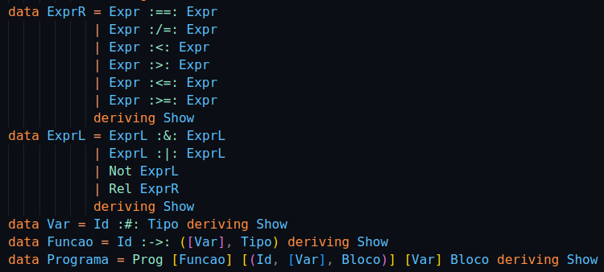
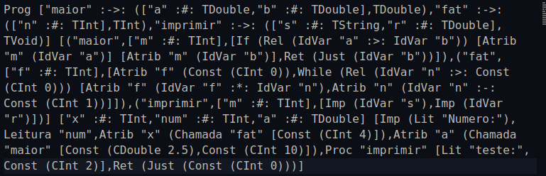
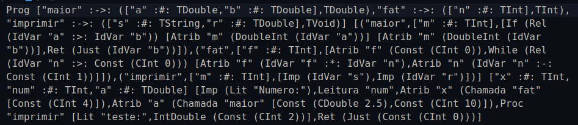
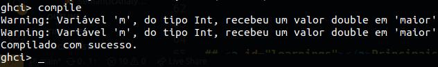

[🇺🇸 🇬🇧 View in English](https://github.com/peedrofernandes/my-compiler/blob/main/README.md)

# Meu Compilador

### Sumário

- [Contexto](#context)
- [Funcionalidades](#features)
- [Como usar](#how-to-use)
- [Principais aprendizados](#learnings)

## <a id="context"></a>Contexto

Este repositório contém o trabalho da disciplina de **Compiladores**, feita por [Pedro Fernandes](https://github.com/peedrofernandes) no curso de **Ciência da Computação** na [Universidade do Estado de Santa Catarina - Centro de Ciências Tecnológicas (UDESC-CCT)](https://www.udesc.br/cct) em Junho de 2023.

O trabalho foi desenvolvido por completo na linguagem **Haskell**, uma linguagem cujo paradigma de programação é **funcional** e **declarativo**. Apesar de ser uma linguagem extremamente complexa de compreender, uma vez que foge da intuição natural de programadores acostumados com os paradigmas **imperativos** e **orientados a objeto**, a escolha da linguagem poupou esforços para a construção do compilador justamente pela sua característica declarativa em vez de imperativa. Não ter que se preocupar com detalhes de implementação de baixo nível, e.g. criação de estruturas de dados com controle manual da alocação de memória ajudou no desenvolvimento, uma vez que um compilador envolve estruturas complexas como **tabelas de escopo**, **árvores sintáticas**, **gramáticas**, **linguagens formais** e muito mais. Todos esses conceitos possuem níveis extremos de **recursividade**, o que favorece a escolha de paradigmas funcionais. 

Outro fator que pesou positivamente para a escolha da linguagem Haskell foi o seu **sistema de tipagem forte**, que é extremamente necessário para a construção do compilador.

Na disciplina, não foi abordado o assunto da transformação efetiva do programa criado em linguagem de máquina, porque esse é um processo complexo não-produtivo para a disciplina, envolvendo conhecimentos mais pertinentes à disciplina de [Arquitetura de Computadores](https://github.com/peedrofernandes/udesc-aoc) do que Compiladores propiramente dito. Para realizar essa tarefa, seria necessário, a partir do código analisado final, transformar em código de máquina para a maioria das **arquiteturas de hardware**, o que seria uma tarefa difícil.

A linguagem compilada não tem nome. É, basicamente, uma versão muito simples e inútil da linguagem C.

## <a id="features"></a>Funcionalidades

O projeto pode ser concebido em quatro partes diferentes: A [**configuração**](#config), a [**análise sintática**](#parser), a [**análise semântica**](#semantic-analysis) e o [**tratamento de erros**](#error-handling).

#### <a id="config"></a>Configuração

Antes que o compilador possa ser executado, ele precisa ser configurado corretamente. A configuração é feita com o auxílio da biblioteca nativa do haskell, [Parsec](https://hackage.haskell.org/package/parsec), para determinar:

- Os tipos de dados que irão compor a **Árvore Sintática**, que é uma estrutura uniforme e computacionalmente compreensível sobre um específico programa de computador;
- A **tabela de tokens**, que determinará todos os tokens (palavras e expressões reservadas);
- A especificação da precedência dos **operadores aritméticos**, **lógicos** e **relacionais**;
- Algumas funções auxiliares adicionais.



#### <a id="parser"></a> Análise Sintática

Em `./src/Parser.hs`, novamente o [Parsec](https://hackage.haskell.org/package/parsec) é utilizado para construir um analisador sintático que varre o código inteiro da esquerda para a direita, verificando erros sintáticos e, eventualmente, retornando uma **Árvore Sintática**. O Parsec permite que um analisador sintático complexo seja criado a partir de **pequenos analisadores sintáticos pontuais**, usando a estratégia dividir-e-conquistar para criar um **analisador sintático grande e complexo**. Tudo isso é feito com **Mônadas**, que ajudam a abstrair contextos entre as combinações dos analisadores sintáticos.



#### <a id="semantic-analysis"></a>Análise Semântica

Em `./src/SemanticAnalyzer.hs` foi construído o **Analisador Semântico** do compilador. Esse analisador é responsável por receber como entrada uma árvore sintática, verificar corretude semântica e, eventualmente, caso nenhum erro semântico seja detectado, devolver outra árvore semântica que pode ter correções semânticas.

Novamente, as **Mônadas** ajudaram na construção do Analisador Semântico porque uma tarefa essencial era levar em conta as variáveis dentro do escopo.

Algumas das tarefas do analisador semântico são:

- Em **expressões binárias aritméticas** ou **relacionais** quando um dos operandos for do tipo **int** e o outro for do tipo **double** o **operando do tipo int deve ser convertido à double**;
- Atribuição de variáveis ou retorno de funções com tipos conflitantes devem ocasionar a **emissão de mensagens de erro**;
- A **chamada de funções não declaradas** deve ocasionar a emissão de uma **mensagem de erro**;



#### <a id="error-handling"></a>Tratamento de erros

O compilador pode emitir tanto **warnings** quanto **mensagens de erro**. Ao emitir mensagens de erro, sua execução é encerrada imediatamente. O mesmo não acontece com warnings.



## <a id="how-to-use"></a>Como usar

Antes de rodar o compilador em sua máquina local, certifique-se de ter o interpretador **ghci** instalado na sua máquina. Ele pode ser baixado [aqui](https://haskell.org/downloads).

Faça um clone do projeto na sua máquina local, executando o seguinte comando:

```git clone https://github.com/peedrofernandes/my-compiler.git```

Navegue para o diretório-fonte do projeto, depois para a pasta `./src` e execute o seguinte:

```ghci Main.hs```

Uma vez que todos os arquivos foram compilados com sucesso, você estará dentro do ambiente Haskell fornecido pelo GHCI. Apenas chame a função "compile", simplesmente digitando `compile`. O compilador deverá buscar o arquivo especificado em `src/Main.hs`, por padrão especificado como um dos arquivos dentro da pasta `src/code`. Caso nenhum feedback seja dado no terminal (ou apenas mensagens de warnings), a compilação terminou em êxito. Verifique os arquivos dentro da pasta `src/output`.

## <a id="learnings"></a>Principais aprendizados

Com esse projeto, foi possível compreender a complexidade envolvida em cada etapa do processo de transformação de um código de uma linguagem de programação em uma estrutura de dados que pode ser efetivamente processada.

