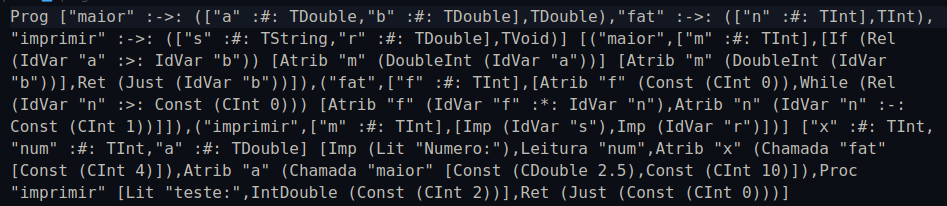
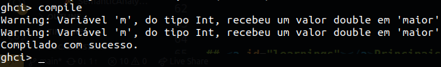

[🇧🇷 Ver em Português](https://github.com/peedrofernandes/my-compiler/blob/main/README-pt-BR.md)

# My Compiler

### Summary

- [Context](#context)
- [Features](#features)
- [How to use](#how-to-use)
- [Learnings](#learnings)

## <a id="context"></a>Context

This repository contains the final production of the **Compilers** subject, made by [Pedro Fernandes](https://github.com/peedrofernandes) in the **Computer Science** course at the [University of the State of Santa Catarina - Technological Sciences Center (UDESC-CCT)](https://www.udesc.br/cct) in June 2023.

The project was fully developed in **Haskell**, a programming language whose paradigm is **functional** and **declarative**. Despite being a extremely complex language to understand, since it escapes the natural intuition of programmers that use to code in **imperative** and **object-oriented** paradigms, the choice of the language spared efforts to build the compiler precisely because of its declarative rather than its imperative nature. Not having to worry about low-level implementation details, e.g. the creation of data structures with manual control of memory allocation, helped on the development, as a compiler involves complex structures like **scope tables**, **syntatic trees**, **grammars**, **formal languages** and much more. All of these concepts have extreme levels of **recursion**, which favors the choice of functional paradigms.

Another factor that weighed positively in choosing the Haskell language was its *strong typing system*, extremely necessary for building the compiler.

On the discipline, the subject of the effective transformation of the program created into machine language was not addressed, because this is a complex and non-productive process for the course, involving much more knowledge of [Computer Architecture](https://github.com/peedrofernandes/udesc-aoc) than compilers themselves. To perform this task, it would be necessary, from the final analyzed code, transform it into a machine code for each main architecture of a variety of **hardware architectures**, hence it would be a difficult task.

The language compiled doesn't have a name. It's basically a very-simple and unuseful version of the C language.

## <a id="features"></a>Features

The project can be conceived into four different parts: The [**configuration**](#config), the [**parsing**](#parser), the [**semantic analysis**](#semantic-analysis) and the [**error handling**](#error-handling).

#### <a id="config"></a>Configuration

Before the compiler can be executed, it must be correctly configured. The configuration is made with the help of the Haskell's native library, [Parsec](https://hackage.haskell.org/package/parsec), to determine:

- The types of data that will compose the **Syntax Tree**, which is a uniform and computationally comprehensible data structure that represents a program;
- The **Tokens Table**, that will determine every token (words and reserved expressions);
- Specification about the precedence of **arithmetic, logic, relational, binary and unary operators**;
- Some additional auxiliary functions. 


#### <a id="parser"></a>Parsing

In `./src/Parser.hs`, again [Parsec](https://hackage.haskell.org/package/parsec) is used to build a parser that scans the entire code from left to right, checking syntatic errors and, eventually, returning a **Syntax Tree**. Parse allows a complex parser to be created using other **smaller parsers**, using the divide-and-conquer strategy to create a **big and complex parser**. Everything is made with **Monads**, that helps to abstract contexts between combinations of the parsers.


#### <a id="semantic-analysis"></a>Semantic Analysis

Em `./src/SemanticAnalyzer.hs` foi construído o **Analisador Semântico** do compilador. Esse analisador é responsável por receber como entrada uma árvore sintática, verificar corretude semântica e, eventualmente, caso nenhum erro semântico seja detectado, devolver outra árvore semântica que pode ter correções semânticas.

The **Semantic Analyzer** of the compiler was built in `./src/SemanticAnalyzer.hs`. This analyzer is responsible for receiving an already parsed **Syntax Tree** as an input, checking semantic correctness and eventually, if no semantic error is detected, returning another semantic tree that may (or not) have semantic corrections. 

**Monads** came on handy this time again, because an essential task of the semantic analyzer was verifying correctness of variables used in scope. That needed a context and monads provided that context very well. 

Some of the Semantic Analyzer's tasks are:

- On **arithmetic** or **relational binary expressions**, when one of the operands is of type **int** and the other is of type **double**, the **operand of type int must be converted to double**.
- Variable attributions or function returnings with conflicting types **must generate error messages**;
- The **call of non-declared functions must generate an error message**.



#### <a id="error-handling"></a>Error handling

The compiler can issue both **warnings** and **error messages**. When issuing error messages, the execution of the program is terminated immediately. The same does not happen with warnings.



## <a id="how-to-use"></a>How to use

Before running the compiler in your local machine, make sure you have the **ghci** interpreter installed on it. It can be downloaded [here](https://haskell.org/downloads).

Make a clone of this project on your local machine, executing the following command:

```git clone https://github.com/peedrofernandes/my-compiler.git```

Move to the source directory of the project you just cloned, now go to `./src` folder and run the following:

```ghci Main.hs```

Once every file is succesfully compiled, you'll be inside the Haskell environment provided by GHCI. Just call the "compile" function simply typing `compile`. The compiler should search for the file specified in `src/Main.hs`, by default specified as one of the files inside the folder `src/code`. In the case of any feedback was given (or only warning messages), the compilation finished with success. Check the files inside the folder `src/output`. 

Now you can change the code compiled by this compiler to see if it throws an error or warning messages.

## <a id="learnings"></a>Principais aprendizados

With this project, it was possible to understand the complexity involved in each step of the process of transforming a programming language code into a data structure that can be effectively processed.
